# Browser Gym — Roadmap

*Written 2026-07-24, after the platform sync. Companion to
[`ARCHITECTURE.md`](./ARCHITECTURE.md), which describes what exists today.*

This is deliberately ordered by **what unblocks what**, not by what is most
interesting to build. The first phase is unglamorous and everything else waits on
it.

---

## Where we actually are

The correction loop works. An annotator can open a breaker, review it step by step,
reject a bad step, fork before it, have an agent re-run or drive it by hand, get it
QC-approved, and ship a version-bound sample. That was proven end to end against the
running stack: 23/23 platform checks, 14/14 shipping checks, 397 backend + 160
frontend tests.

**And it is useful for 12 tasks out of 312.**

| | |
|---|---|
| Tasks in the gym | 312 |
| Tasks with a recorded run **on disk** | 315 |
| Tasks with a canonical run **in the platform** | **12** |

That gap is the roadmap. The workflow is not the bottleneck; the data feeding it is.

---

## Phase 0 — Make the data usable

**Goal: an annotator can pick any of ~300 tasks and find a reviewable, forkable run
waiting for them.**

Nothing else on this roadmap is worth starting first. Hiring annotators, defining
taxonomies, scaling throughput — all of it assumes there is something to annotate.

### 0.1 Close the two residual determinism gaps

The gym is deterministic as of commit `1865e80`: `_new_id` derives from
`blake2s(task|seed|prefix|step|seq)`, `_now` from the step clock. Verified — two
full oracle episodes of the same `(task, seed)` produce identical worlds, including
on order-placing tasks.

Two gaps remain, and both **silently corrupt what we capture**, so they come before
any capture work:

| Gap | Effect |
|---|---|
| `mutations.py:521` / `:651` take wall-clock dates for `estimated_delivery` and `next_delivery_date`, both inside the hashed world | Date-granular, so two runs minutes apart agree and two either side of midnight do not. **Every stored golden containing an order stops replaying the day after capture.** Derive them from the step clock like `_now` |
| Per-app id counters (`MailState._next` and the food/calendar/market equivalents) appear in neither `to_json()` nor `statecodec._MUTABLE_SUBAPP` | A mid-episode restore restarts the counter, so the next minted id overwrites an existing record. Breaks checkpoint restore |

The first is the more dangerous shape: invisible to same-day testing, degrading
silently over time.

> **Exit criteria:** a run captured today still replays byte-identically tomorrow,
> and a checkpoint restored mid-episode mints no colliding ids.

### 0.2 Re-capture the archive

The 4,760 archived runs were recorded **before** `1865e80`. They contain ids drawn
from `secrets.token_hex` that today's gym will never reproduce — which is exactly
why replay-backfill against them tops out at 60% of steps, with the cutoff landing
where each run's first randomly-minted id appears (five for five).

No amount of further work on the gym recovers those runs. They need re-capturing,
which is now cheap and reproducible: a deterministic oracle run costs nothing but
wall clock.

The caveat is what an oracle run *is*. It produces a **passing** trajectory, so it
seeds the platform with something reviewable but cannot stand in for a breaking run.
The 85-breaker set needs a model, which costs money — see
[Open questions](#open-questions).

> **Exit criteria:** every task has a freshly captured run whose world trail
> reconstructs, and every task in the 85-breaker set has a captured *breaking* run.

### 0.3 Ingest into the platform

`app/backfill.py` already turns a captured run into a canonical, forkable record and
is self-validating — it accepts a reconstruction only when it matches what was
recorded, and skips otherwise.

Sequence matters: ingesting the pre-`1865e80` archive locks in the 60% ceiling
permanently. Ingesting freshly captured runs does not.

> **Exit criteria:** ≥250 of 312 tasks have a canonical run bound in the platform,
> each with a per-step world trail and semantic locators on every action step.

---

## Phase 1 — Define the work

**Goal: someone can be handed the task list and know what "done" means without
asking.**

Aarunik raised this in the sync: the flows were generated ad hoc and there is no
defined scope. That is accurate, and it blocks hiring annotators — you cannot brief
someone against an undefined target.

### 1.1 Workflow taxonomy — *Aarunik, Shravan, Dhiren*

Define the behaviours the benchmark is meant to cover: search, filter, sort,
add-to-cart, checkout, returns, subscription management, cross-app reconciliation,
constraint compliance. For each: what a correct trajectory looks like, and what
failure modes are interesting.

This is the input to both the scope document and the annotator brief.

### 1.2 Benchmark definition — *Shravan, Aarunik*

Survey existing open-source CUA benchmarks and decide what we match and where we
deliberately differ. Jaiprasad's specific ask: check whether our data collection
(dense bounding boxes, DOM dumps) aligns with current practice.

### 1.3 Verifier semantics, written down

Our own README says verifiers "never read the URL"; 50 of 284 suites do. Before we
send verifier samples to partners, the semantics need a canonical written
description — [`ARCHITECTURE.md §3.3`](./ARCHITECTURE.md#33-verifiers--read-this-section-carefully)
is the first pass.

> **Exit criteria:** a scope document exists that a new annotator and a new engineer
> can both work from.

---

## Phase 2 — Scale the workflow

**Goal: multiple annotators working in parallel without stepping on each other.**

### 2.1 Repository split — *Jaiprasad, Kashyap, Dhiren*

Move to GitHub, split the annotator into separate front-end and back-end repos. The
boundary is already clean — the frontend talks to the backend only over HTTP, with
no shared build — so this is mechanical.

### 2.2 Turn on workspace isolation

Implemented and tested, off by default. The gym holds **one global session per
process**, so two annotators driving live browsers against a shared gym corrupt each
other's world. This must be on before more than one person works live simultaneously.

### 2.3 Multi-annotator operations

Per-annotator queues, the QA adjudication path, and the disposition workflow
(`model_failure` · `task_unsolvable` · `environment_broken` · `seed_invalid` ·
`instruction_ambiguous` · `verifier_invalid`) — which is what will finally answer
*"was it the model or the harness?"* for the 85-breaker report. Amit's missing-date
failure is exactly a `seed_invalid`.

### 2.4 Rerun cap

Implemented, off by default, and correctly so — capping reruns before manual
fallback is proven at scale would strand annotators with no way forward. Turn on
once 2.3 is running.

> **Exit criteria:** three annotators work a shared queue for a day without
> collision, and the disposition summary explains every failed attempt.

---

## Phase 3 — Ship

The sync confirmed a **dual scope**: targeted customer samples *and* a full public
benchmark. Both are reachable from the same pipeline; they differ in volume and
polish, not in mechanism.

- **Customer samples** — small, curated, high-confidence. Gated on Phase 0 plus a
  handful of Phase 1 taxonomy decisions.
- **Public benchmark** — the full task set with a published protocol, the coverage
  matrix, and the validity write-up. Gated on all of Phase 2.

Deployment scaffolding exists (`infra/deploy-gcp.sh`, Cloud Run + Cloud SQL) but has
not been exercised this cycle. It needs a pass before anything runs outside a laptop.

---

## Open questions

These need decisions from the team, not implementation.

### Dynamic seed databases vs. reproducibility

The sync leaned toward **dynamic, per-task seed databases** to stop models
memorising static patterns — good instinct for an RL environment. But it collides
with the property everything here rests on: **a task is `(task_id, seed)` and must
reproduce byte-identically.**

The collision is resolvable, and the gym already demonstrates the resolution:
dynamic generation is fine as long as it is **seeded** rather than random. `_new_id`
was drawing from `secrets.token_hex` and now derives from
`blake2s(task|seed|prefix|step|seq)` — same variety, fully reproducible. If a
per-task database is generated from `(task_id, seed)` it is both varied and
replayable; generated from entropy, we lose replay, checkpoints, forking and the
ability to verify a golden at all.

**Ask:** confirm dynamic seeding means *seeded generation*, not *random generation*.

### Model spend

Dhiren measured roughly **$350 for 20–30 tasks** on Gemini 3.1 Pro. Re-capturing
breakers across the full set is therefore a real budget line, not a rounding error.
The oracle is free but only produces passing runs.

**Ask:** a budget envelope for breaker re-capture, and which model tier to use.

### What "human in the loop" means for verifiers

Today verifiers are Python predicates authored in the gym, with the annotator
authoring a parallel suite in the platform. Whether those converge — annotator-authored
verifiers feeding back into the gym — is undecided and shapes the annotator brief.

---

## Sequencing at a glance

```mermaid
gantt
    dateFormat X
    axisFormat %s
    section Phase 0 · data
    Close determinism gaps     :p01, 0, 1
    Re-capture the archive     :p02, after p01, 2
    Ingest into the platform   :p03, after p02, 2
    section Phase 1 · scope
    Workflow taxonomy          :p11, 0, 3
    Benchmark definition       :p12, 0, 3
    section Phase 2 · scale
    Repo split                 :p21, 1, 1
    Workspace isolation        :p22, after p02, 1
    Multi-annotator ops        :p23, after p22, 2
    Rerun cap                  :p24, after p23, 1
    section Phase 3 · ship
    Customer samples           :p31, after p03, 2
    Public benchmark           :p32, after p24, 3
```

Phase 1 runs in parallel with Phase 0 — it is research and definition work with a
different owner set, and it does not touch the pipeline.

---

## Immediate next actions

From the 2026-07-24 sync, with current status:

| Owner | Action | Status |
|---|---|---|
| Dhiren | Technical documentation | ✅ [`ARCHITECTURE.md`](./ARCHITECTURE.md) |
| Dhiren | Roadmap | ✅ this document |
| Dhiren | Post both to Canvas | Next |
| Dhiren | Verifier samples → Aarunik | Ready to extract — see the correction in [§3.3](./ARCHITECTURE.md#33-verifiers--read-this-section-carefully) before sending |
| Jaiprasad | GitHub repos + access | Pending |
| Dhiren, Aarunik, Shravan | Scope + taxonomy document | Pending |
| Arun | Run samples → Shravan | Pending |
